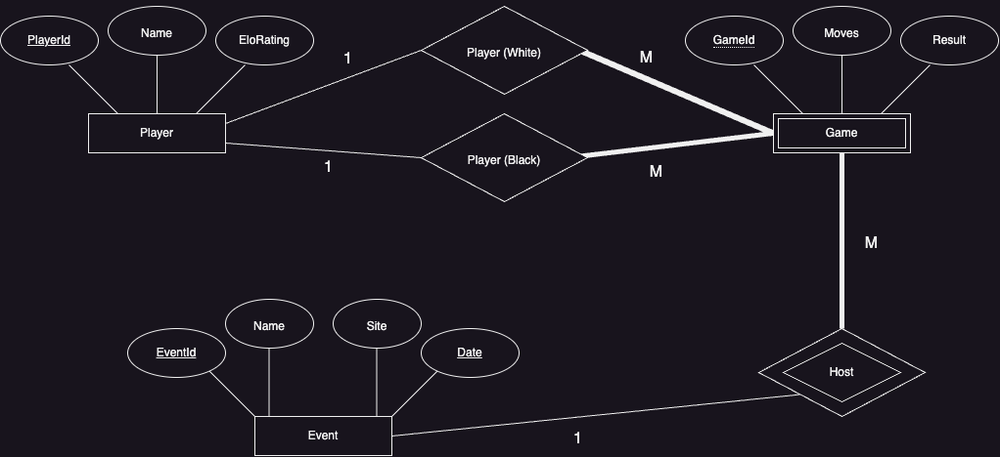

## Reduce your ER diagram to schemas
```txt
Player[__PlayerId (integer)__, Name (string), EloRating (integer)]
Game [__GameId (integer)__, Moves (string), Result (string), BlackPlayerId (integer), WhitePlayerId (integer), EventId (integer)]
Event [__EventId (integer)__, Name (string), Site(string), Date (Date)]
```
## Tables
```mysql
CREATE DATABASE Chess;
USE Chess;

CREATE TABLE Player (
    PlayerId INT PRIMARY KEY,
    Name VARCHAR(255),
    EloRating INT
)

CREATE TABLE Game (
    GameID INT PRIMARY KEY,
    Moves VARCHAR(1000),
    Result VARCHAR(7),
    BlackPlayerId INT,
    WhitePlayerId INT,
    EventId INT,
    FOREIGN KEY (EventId) REFERENCES Event (EventId),
    FOREIGN KEY (BlackPlayerId) REFERENCES Player (PlayerID),
    FOREIGN KEY (WhitePlayerId) REFERENCES Player (PlayerID)
)


CREATE TABLE Event (
    EventId INT PRIMARY KEY,
    Name VARCHAR(255),
    Site VARCHAR(255),
    Date DATE,
    CONSTRAINT UC_events UNIQUE (Name, Date)
)
```